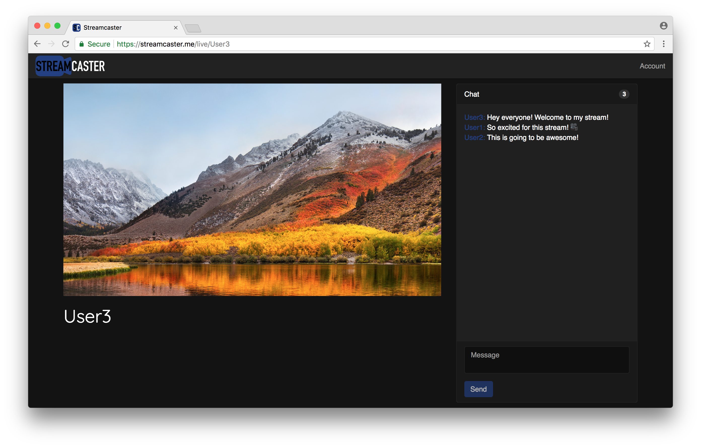
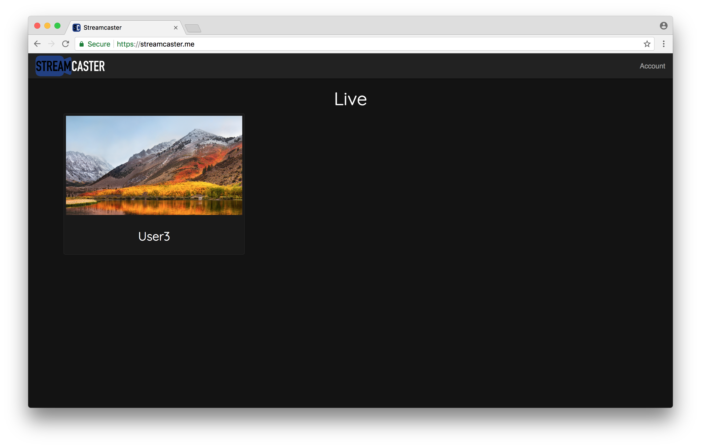
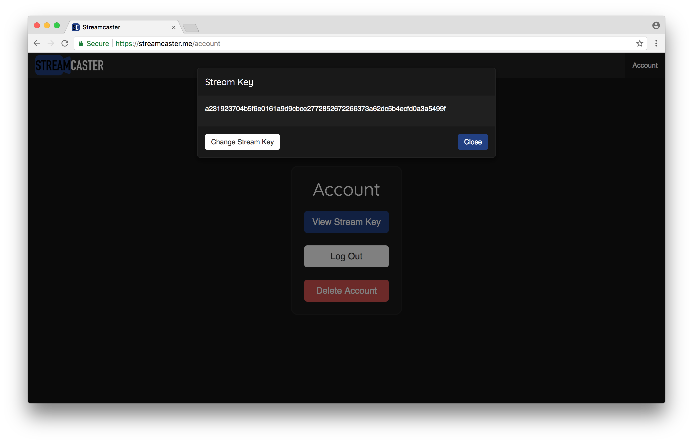
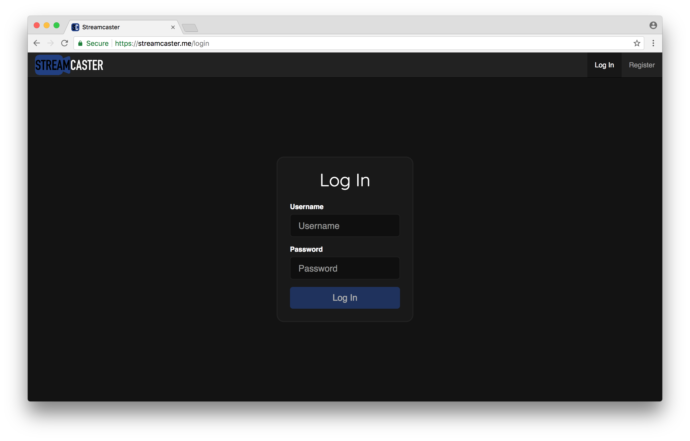

# Streamcaster

**Streamcaster is a live streaming platform that anyone can sign up for to live stream whatever content they choose using popular live streaming software such as Open Broadcaster Software (OBS).** People can view these live streams and participate in chat with other viewers if they choose to sign up. The server is built primarily with Node.js and the client is built with React. Account information is stored in a MySQL database. Nginx is used as a reverse proxy for the Node.js server and to ingest RTMP streams from software like OBS. These streams are authenticated with a stream key which can be found on the account page after logging in. Once authenticated, the streams are then transcoded into multiple HLS variants of different resolutions and frame rates using FFmpeg and a custom Bash script, which also periodically generates stream thumbnails. The React client integrates with the server RESTful API to get stream information, such as thumbnails, and accesses the HLS fragments on the server to display streams to viewers. Socket.IO provides real-time stream chat and viewer count.

## Server Setup Instructions

### Prerequisites

* Node.js 9.11.1
* npm 5.8.0
* MySQL 5.7.22
* nginx-rtmp-module 1.2.1
* Nginx 1.13.12
  * configure arguments: --with-http_ssl_module --with-http_stub_status_module --with-file-aio --with-http_v2_module --add-module=nginx-rtmp-module
* FFmpeg 3.0.11
  * configure arguments: --enable-gpl --enable-libass --enable-libfdk-aac --enable-libfreetype --enable-libmp3lame --enable-libopus --enable-libtheora --enable-libvorbis --enable-libvpx --enable-libx264 --enable-libx265 --enable-nonfree

### Installation

1. Build the versions of Nginx and FFmpeg listed above with the specified configure arguments

2. Setup the MySQL database

```
CREATE DATABASE database;
USE database;
CREATE TABLE accounts (uid VARCHAR(16) NOT NULL, username VARCHAR(32) NOT NULL, password VARCHAR(64) NOT NULL, stream_key VARCHAR(64) NOT NULL, PRIMARY KEY (uid), UNIQUE KEY uid (uid), UNIQUE KEY username (username), UNIQUE KEY stream_key (stream_key));
CREATE USER 'username'@'localhost' IDENTIFIED BY 'password';
GRANT ALL ON database.* TO 'username'@'localhost';
FLUSH PRIVILEGES;
```

3. Install Node.js dependencies

```
npm install
```

4. Create the .env file and add the variables PORT, DB_HOST, DB_USER, DB_PASS, DB_NAME, COOKIE_NAME, COOKIE_SECRET, and COOKIE_DOMAIN to it

5. Create the thumbnails directory in the server directory

```
mkdir thumbnails
```

### Running

1. Make sure MySQL is running

2. Create all necessary directories and run Nginx with the nginx.conf that is in the server directory

3. Run the Node.js server

```
node index.js
```

## Client Setup Instructions

### Prerequisites

* npm 5.8.0
* create-react-app 1.5.2

### Installation

1. Install dependencies

```
npm install
```

### Running

1. Run the React app in development mode

```
npm start
```

## Screenshots








